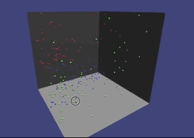

# 3D KMeans visualisation with Javascript

KMeans is an algorithm that finds clusters in groups of data. This can be used to label unclassified data - unsupervised learning. These labels can later be used for supervised learning. 

This experiment creates a 3D chart to visualise clusters in a nice way. Use the mouse to rotate the chart. 



## Create a 3D chart
```javascript
let chart = new Chart3D()
```
The [ThreeJS](https://threejs.org/) chart can draw points in 3 dimensions. A single point looks like: `[30,5,19]`. 

## Draw an array of points

First get some fake data
```javascript
let data = createFakeData()
```

Draw raw data in the chart to see what it looks like
```javascript
chart.addData(data)
```

You can clear the chart with
```javascript
chart.clearGraph()
```

## Create Kmeans

```javascript
let km = new Kmeans()
```
Find 3 clusters using the Kmeans algorithm in the raw data. Draw the clusters by calling `addClusters()`

```javascript
km.createClusters(data, 3, (clusters, centroids) => {
    chart.addClusters(clusters)
})
```

## Native modules

This experiment uses native modules.

```html
<script type="module" src="./app.js"></script>
```

Kmeans and the 3DChart can be used by importing into `app.js`:
```javascript
import { Chart3D } from "./native_modules/Chart3d.js"
import { Kmeans } from "./native_modules/Kmeans.js"
```

### TODO

- ⚠️ Normalise data before displaying / training.
- Use Promises instead of callback.
- More than 3 colors in chart
- Chart legend

### Links

- [Kmeans explanation](https://towardsdatascience.com/understanding-k-means-clustering-in-machine-learning-6a6e67336aa1)
- [Kmeans JS algorithm](https://github.com/stevemacn/kmeans)
- [ThreeJS 3D basics](https://threejs.org/docs/#api/en/geometries/PlaneGeometry)

